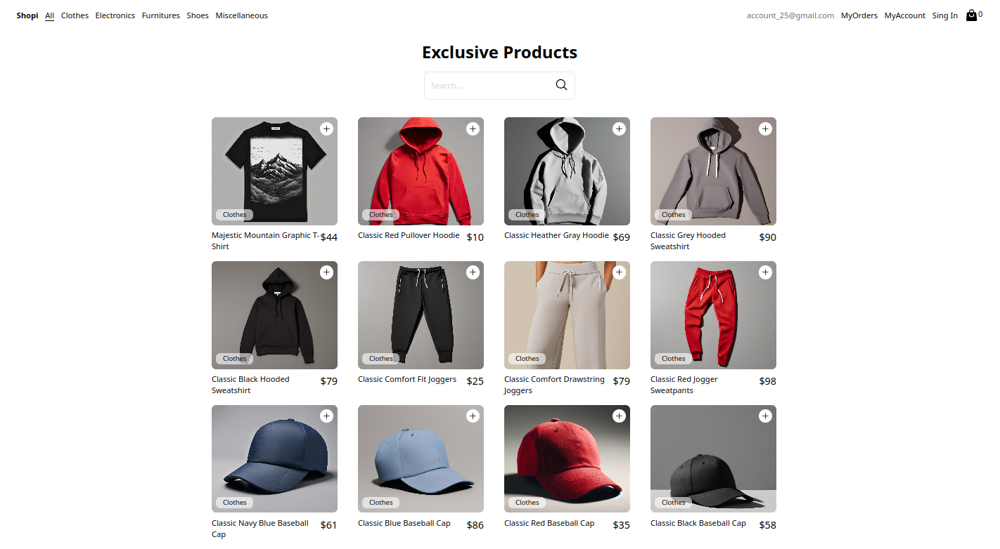

# 🛒 Ecommerce - Shopi

**Shopi** es una aplicación de e-commerce desarrollada con **React**, **Vite**, **TailwindCSS**, y **React Router DOM**. Permite a los usuarios agregar productos al carrito, filtrar productos por categoría o nombre, crear órdenes de compra y ver detalles de los productos de forma sencilla y rápida.

## 🚀 Tecnologías utilizadas

- **React**: Biblioteca principal para la construcción de interfaces de usuario.
- **Vite**: Herramienta de desarrollo rápida para aplicaciones web modernas.
- **TailwindCSS**: Framework de CSS para diseño rápido y responsivo.
- **React Router DOM**: Manejo de rutas y navegación entre páginas de manera sencilla.

## 🛠️ Funciones principales

- **Agregar productos al carrito**: Gestiona los productos seleccionados por el usuario.
- **Filtrar productos**: Encuentra productos por nombre o categoría de forma eficiente.
- **Crear órdenes de pedidos**: Genera órdenes basadas en el carrito actual.
- **Ver detalles de productos**: Accede a información detallada de cada producto.

## 🌐 Deploy

Puedes acceder a la aplicación en el siguiente enlace:  
[Shopi en Netlify](https://main--amazing-meerkat-b9c5bd.netlify.app/)

## 📦 Instalación y configuración

Sigue estos pasos para configurar el proyecto en tu máquina local:

1. **Clona este repositorio**:
   ```bash
   git clone https://github.com/tu-usuario/tu-repo.git
   cd tu-repo
   ```

## 🖥️ Scripts disponibles

- **npm run dev**: Inicia el servidor de desarrollo.
- **npm run build**: Crea una versión optimizada para producción.

## 👤 Autor

Creado por Derek.
Si tienes dudas o sugerencias, no dudes en contactarme.

## 📄 Licencia

Este proyecto está licenciado bajo la MIT License. Consulta el archivo LICENSE para más detalles.

##

- **¡Gracias por explorar este proyecto! 🎉**
  - Si te resulta útil, considera dejar una estrella ⭐ en el repositorio.

##


